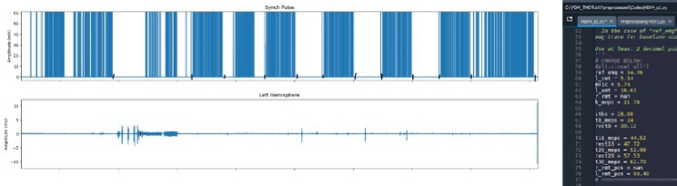
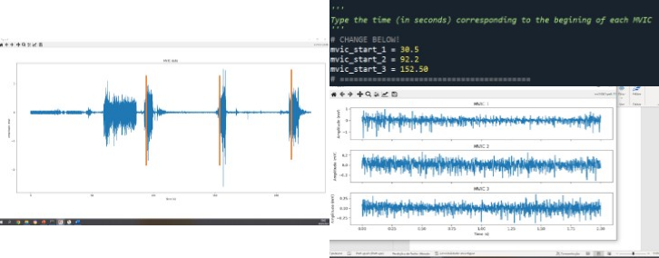
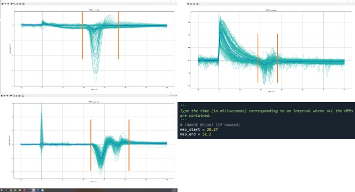
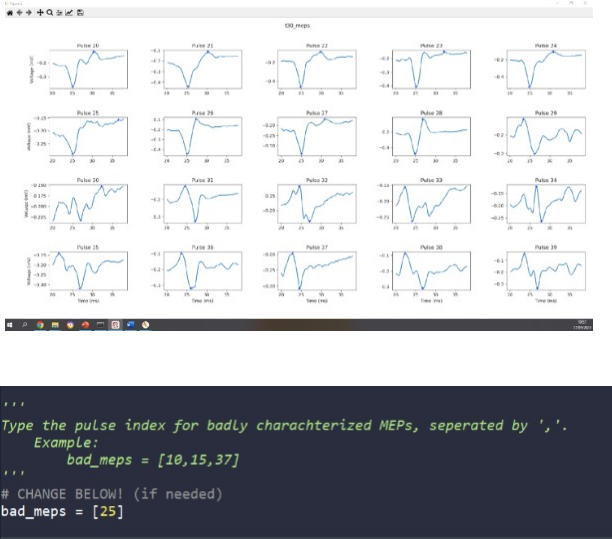
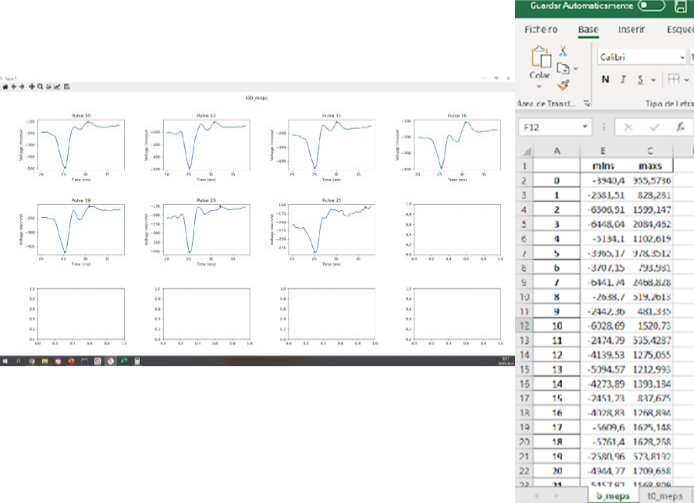

# MEP Preprocessing

This repository provides a **structured preprocessing pipeline for motor evoked potentials (MEPs)** acquired with transcranial magnetic stimulation (TMS).  

The workflow includes:  
- **Signal denoising** with a three-level adaptive wavelet filter (Daubechies family, db1) and BayesShrink soft thresholding.  
- **Smoothing** with a Savitzky–Golay filter, chosen over conventional band-pass filtering to minimize distortions.  
- **Automated screening** of trials based on amplitude thresholds and background EMG activity, with criteria adapted from established literature.  

The pipeline is designed to **facilitate amplitude extraction and quality control of MEPs** with minimal coding expertise. It combines automated detection with guided manual correction to ensure reliable results.  

This pipeline has been used and described in:  
- Faro Viana F, et al. *Reducing motor evoked potential amplitude variability through normalization.* **Front Psychiatry.** 2024;15:1279072. doi:[10.3389/fpsyt.2024.1279072](https://doi.org/10.3389/fpsyt.2024.1279072)  
- Seybert C, et al. *Replicability of motor cortex-excitability modulation by intermittent theta burst stimulation.* **Clin Neurophysiol.** 2023;152:22–33. doi:[10.1016/j.clinph.2023.04.014](https://doi.org/10.1016/j.clinph.2023.04.014)  

A step-by-step guide is included to support **file selection, EMG segmentation, epoch definition, visual inspection, and correction of flagged trials**.  

> ⚠️ **Note:**  
> The step-by-step guide refers to an **older version of the pipeline**, which is available in the folder [`old_pipeline`](./old_pipeline).  
> This repository is currently being updated with a **new GUI-based pipeline**, which will replace the older version.

---

<strong>4.1. File Selection for Preprocessing</strong>

Set the `name` variable to the filename and run the section. Filenames must follow the structure:

{subID}{ses}{hemi}_yyyy-mm-dd_HH-MM-SS

<strong>4.2. EMG Segmentation</strong>

After running the section, the EMG trace and TMS pulse time series will be displayed. Segmentation of the signal begins here.

<strong>4.2.1. First-Level Segmentation</strong>

Split the EMG signal into segments corresponding to different phases of the experiment.

- **Left panel (top):** TMS pulse markers; **Left panel (bottom):** Raw EMG signal; **Right panel:** Code snippet to be edited  

**To segment:**

1. Use the figure cursor in Spyder (left panel) to locate the end of each segment, using TMS pulse markers as reference.  
2. Enter the values into the corresponding segment variables in the script (right panel).  
3. Define the reference EMG used for baseline control by choosing the start of a 500 ms window with stable EMG activity and enter it in `ref_emg`.  

After filling in the variables, execute and advance to the next section.

<strong>4.2.2. MVIC Segmentation</strong>

Define the start of a 3 s window for MVIC epochs. This step can be skipped if MEP amplitude is analyzed without normalization.

- **Left panel:** MVIC raw trace  
- **Right panel (top):** Code snippet  
- **Right panel (bottom):** MVIC epoch plot  

Run the section to display the selected MVIC epoch. The amplitude should be stable across the window. If adjustments are needed, update the variable and rerun the section until satisfactory. Then continue to the next section.

<strong>4.2.3. MEP Epoch Definition</strong>

All MEPs will be plotted together. Define the analysis window by specifying the time range (in ms) relative to the TMS pulse.

**Examples of MEP overlap plots:** Without TMS artifact (top left); With large artifact (top right); With complex morphology (bottom left); Bottom right: Code snippet  

<strong>4.3. Visual Inspection of Automatic Peak Detection</strong>

MEPs from each single-pulse block are plotted with markers around detected peaks. Inspect the plots and list in the code snippet the MEP IDs where automatic detection failed.

- **Top:** Example of MEPs with automatic markers. In Pulse 25 the maximum peak requires manual correction; **Bottom:** Code snippet to be edited  

<strong>4.4. Correction of Flagged MEPs</strong>

Flagged MEPs are plotted in detail. Use the cursor to identify the correct peak values and record them in the generated Excel file.

- **Left:** Detailed view of a flagged MEP (Pulse 25), with red cross indicating the correct peak; **Right:** Excel file for manual correction of peak values

---

## References

Faro Viana F, et al. Reducing motor evoked potential amplitude variability through normalization. Front Psychiatry. 2024;15:1279072. doi:10.3389/fpsyt.2024.1279072

Seybert C, et al. Replicability of motor cortex-excitability modulation by intermittent theta burst stimulation. Clin Neurophysiol. 2023;152:22-33. doi:10.1016/j.clinph.2023.04.014

