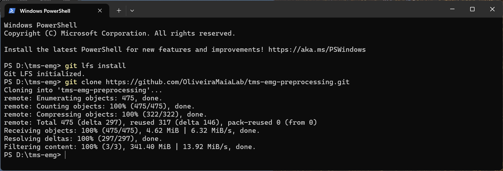
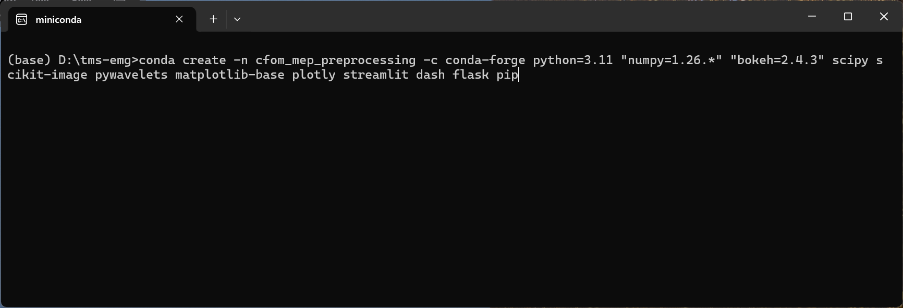
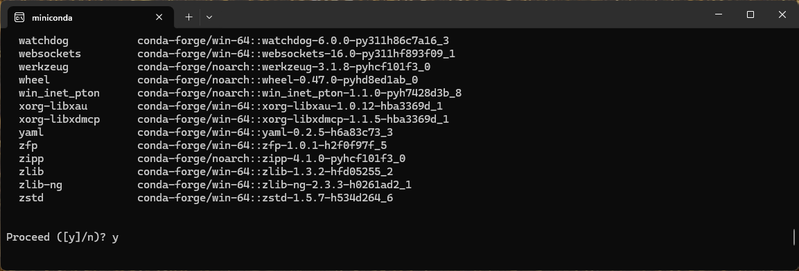
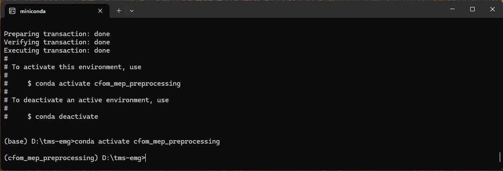
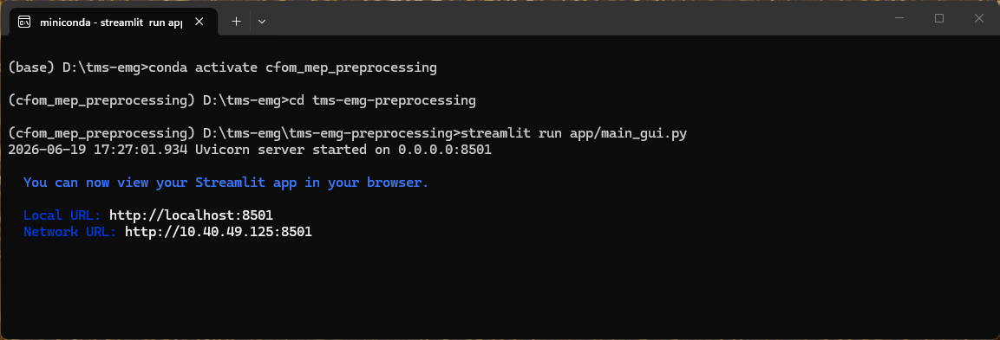

# MEP Preprocessing — Streamlit GUI

This repository provides a structured preprocessing pipeline for **motor evoked
potentials (MEPs)** acquired with **transcranial magnetic stimulation (TMS)**.

The workflow includes:

- **Signal denoising** with a three-level adaptive wavelet filter (Daubechies
  family, db1) and BayesShrink soft thresholding.
- **Smoothing** with a Savitzky–Golay filter, chosen over conventional band-pass
  filtering to minimize distortions.
- **Automated screening** of trials based on amplitude thresholds and background
  EMG activity, with criteria adapted from established literature.

The pipeline is designed to facilitate amplitude extraction and quality control
of MEPs with minimal coding expertise. It combines automated detection with
guided manual correction to ensure reliable results.

The processing is delivered through an interactive **Streamlit** app; some steps
embed **Bokeh server** apps (large time-series exploration, RangeTools) and
**Dash/Plotly** views for richer interaction. A step-by-step guide supports file
selection, EMG segmentation, epoch definition, visual inspection, and correction
of flagged trials.

> 📖 **Documentation** lives in [`docs/`](docs/): a [Quick Guide](docs/quickguide.md)
> for end-to-end usage and a [User Guide](docs/user-guide.md) covering every menu,
> the output data structure, the meaning of each flag, and how to edit or create
> experiment templates.

### Citation

This pipeline has been used and described in:

- Faro Viana F, et al. *Reducing motor evoked potential amplitude variability
  through normalization.* Front Psychiatry. 2024;15:1279072.
  doi:[10.3389/fpsyt.2024.1279072](https://doi.org/10.3389/fpsyt.2024.1279072)
- Seybert C, et al. *Replicability of motor cortex-excitability modulation by
  intermittent theta burst stimulation.* Clin Neurophysiol. 2023;152:22–33.
  doi:[10.1016/j.clinph.2023.04.014](https://doi.org/10.1016/j.clinph.2023.04.014)

---

## 1. Prerequisites

| Tool | Why | Link |
|------|-----|------|
| **Git** | clone the repository | https://git-scm.com/downloads |
| **Git LFS** | the example `.bin` data is stored via Git LFS | https://git-lfs.com |
| **Miniconda** (recommended) | create the Python environment | https://www.anaconda.com/download/success |

> A pure-`pip`/`venv` route is also provided (Option B below) if you'd rather
> not use Conda.

### Install Miniconda

- **Windows** — download and run the *Miniconda3 Windows 64-bit* installer.
- **macOS / Linux** — download the installer for your platform and run it, e.g.:
  ```bash
  # macOS (Apple Silicon shown; pick the matching installer for your machine)
  bash Miniconda3-latest-MacOSX-arm64.sh
  # Linux
  bash Miniconda3-latest-Linux-x86_64.sh
  ```
  Restart your shell afterwards so `conda` is on the `PATH`.

> **Which terminal? (Windows)** Use **two** terminals: run the **Git** commands
> (Step 2) in **Windows PowerShell** (or *Command Prompt*), and run the **Conda**
> commands and the app (Steps 3 and 5) in the **Anaconda / Miniconda Prompt** —
> that's where `conda` is on the `PATH`. On **macOS / Linux** a single terminal
> handles everything once `conda` is initialised.

---

## 2. Clone the repository

On **Windows**, run these in **Windows PowerShell** (or *Command Prompt*); on
**macOS / Linux**, use your terminal.

```bash
git lfs install        # one-time, so the LFS-tracked .bin example data downloads
git clone https://github.com/OliveiraMaiaLab/tms-emg-preprocessing.git tms-emg-preprocessing
cd tms-emg-preprocessing
```



---

## 3. Set up the environment

This project provides three ways to set up the environment:

| Option | How | Platform |
|--------|-----|----------|
| **A — Conda** *(recommended)* | the `conda create` command below | Windows / macOS / Linux |
| **B — pip / venv** | `requirements-pip.txt` | Windows / macOS / Linux |
| **C — exact Windows clone** | `conda-win64-explicit.txt` | **Windows only** |

### ▶️ Option A — Conda *(recommended, cross-platform)*

On **Windows**, run this in the **Anaconda / Miniconda Prompt** (not PowerShell);
on **macOS / Linux**, your terminal:

```bash
conda create -n cfom_mep_preprocessing -c conda-forge python=3.11 "numpy=1.26.*" "bokeh=2.4.3" scipy scikit-image pywavelets matplotlib-base plotly streamlit dash flask pip
conda activate cfom_mep_preprocessing
```



When the solver finishes listing packages, type **`y`** to proceed:



When it completes, activate the environment:



### ▶️ Option B — Plain virtual environment (pip, no Conda)

```bash
python -m venv .venv
# Windows:        .venv\Scripts\activate
# macOS / Linux:  source .venv/bin/activate

python -m pip install --upgrade pip
python -m pip install -r requirements-pip.txt
```

### ▶️ Option C — Exact Windows clone *(maximum reproducibility, win-64 only)*

```bash
conda create -n cfom_mep_preprocessing --file conda-win64-explicit.txt
conda activate cfom_mep_preprocessing
```
Use this only if you need to match the original lab machine bit-for-bit
(identical Conda builds). It will **not** solve on macOS or Linux.

---

## 4. Configure the GUI settings

The app stores your machine-specific defaults (folder paths, researcher ID) in
**`config/.tms_emg_gui_settings.json`**. A placeholder version is committed to the
repo; on a new computer you set it up once.

You do not strictly have to edit it by hand: the file is created automatically the
first time you launch the app, and the **input** screen writes your choices back to
it. So the quickest path is to launch the app, set the fields there, and they
persist. To preset them instead, edit `config/.tms_emg_gui_settings.json`:

```json
{
  "template_file": "experiment_template.json",
  "input_file": "example_data.bin",
  "output_dir": "OUTPUT_FOLDER",
  "data_dir": "RAWDATA_FOLDER",
  "researcher_id": "github"
}
```

| Field | What to put | Notes |
|-------|-------------|-------|
| `template_file` | `experiment_template.json` | Experiment template (channel map + block structure). Ships in `config/`; leave as-is unless you use a custom template. |
| `data_dir` | absolute path to your raw `.bin` folder | The input screen lists the `.bin` files found here. Replace `RAWDATA_FOLDER`. |
| `output_dir` | absolute path for outputs | Where session `.json` files are written (created if missing). Replace `OUTPUT_FOLDER`. |
| `input_file` | last-selected recording | Set automatically when you pick a file in the GUI; may stay as the example or be left blank. |
| `researcher_id` | your initials / ID | Stamped into each processed session for provenance. Replace `github`. |

Windows paths work either as `C:/Users/you/data` or escaped `C:\\Users\\you\\data`.

> **This file changes as you use the app.** The GUI rewrites
> `config/.tms_emg_gui_settings.json` whenever you change paths, so after your first
> run `git status` will show it modified with *your* local paths. To keep
> machine-specific values out of commits, tell Git to ignore local changes:
> ```bash
> git update-index --skip-worktree config/.tms_emg_gui_settings.json
> ```
> (undo with `--no-skip-worktree`). Or keep the placeholder as
> `config/.tms_emg_gui_settings.example.json` and add the real file to `.gitignore`.

---

## 5. Run the app

On **Windows**, in the **Anaconda / Miniconda Prompt**: activate the environment,
`cd` into the cloned repository, and launch the app (on **macOS / Linux**, do the
same in your terminal):

```bash
conda activate cfom_mep_preprocessing
cd tms-emg-preprocessing
streamlit run app/main_gui.py
```



Streamlit will print a **Local URL** (default http://localhost:8501) and open it in
your browser.

---

## Package organization

```
app/
├── __init__.py
├── main_gui.py            # entry point / step router (run this)
├── utils/
│   ├── persistence.py
│   ├── tms_module.py
│   ├── layout.py
│   └── dash_peak_editor.py
├── bk_embedding/
│   ├── segmentation.py
│   └── mepOverlap.py
└── steps/
    ├── step_input.py
    ├── step_confirmInputs.py
    ├── step_segmentation.py
    ├── step_mepWindow.py
    ├── step_peakChecking.py
    ├── step_peakCorrection.py
    └── step_reviewFlag.py
```

See `ARCHUTECTURE.md` for the session-file schema and per-module responsibilities.