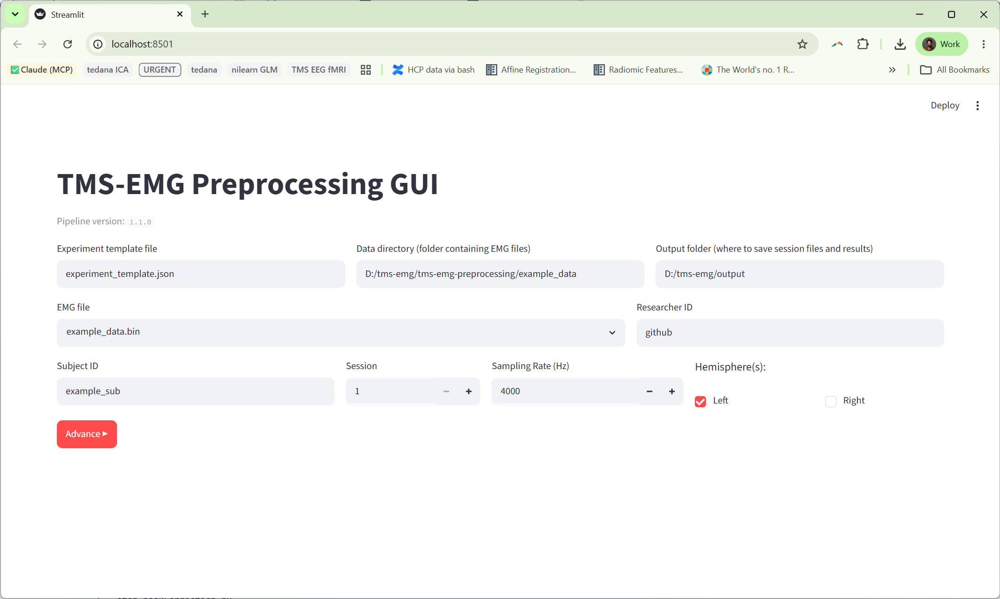
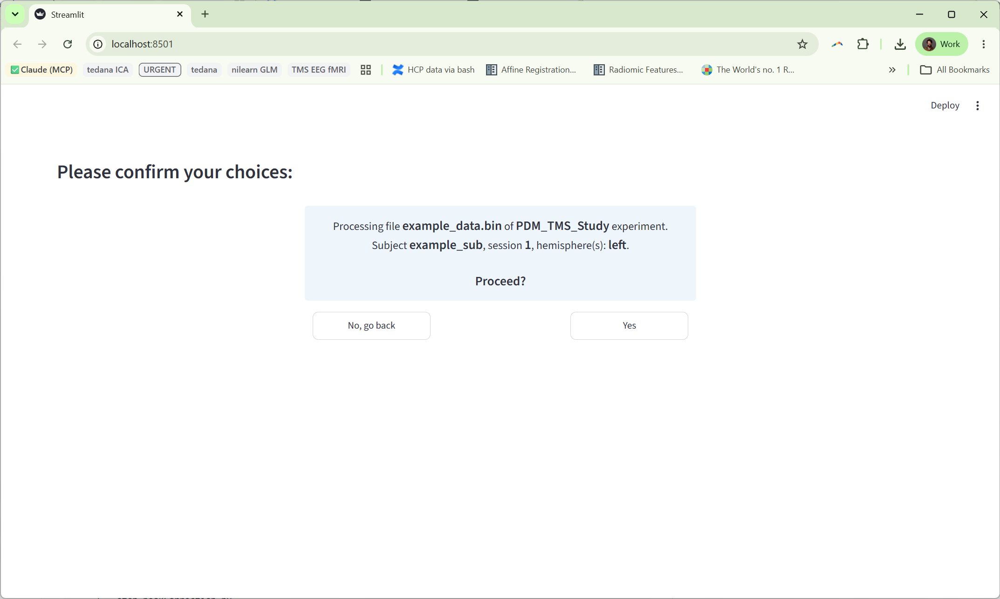
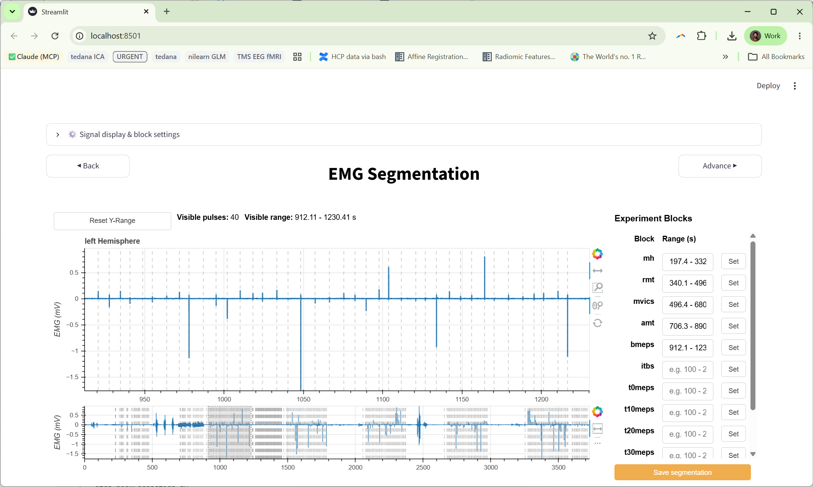
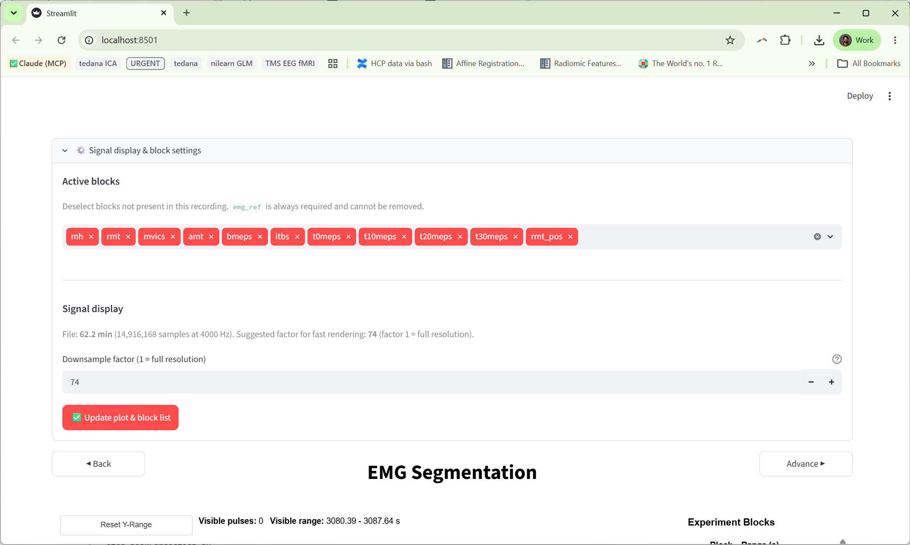
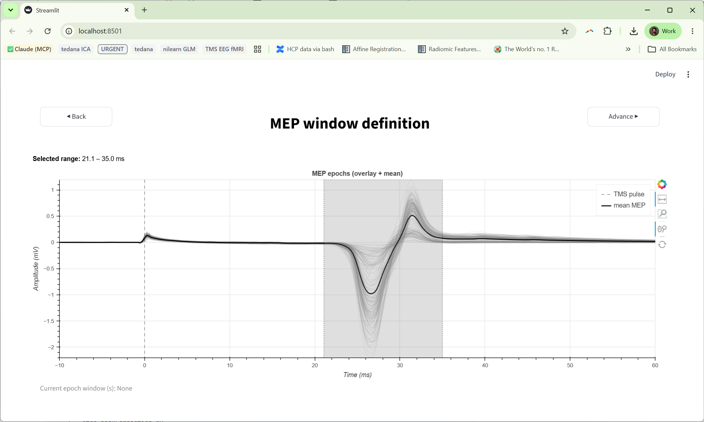
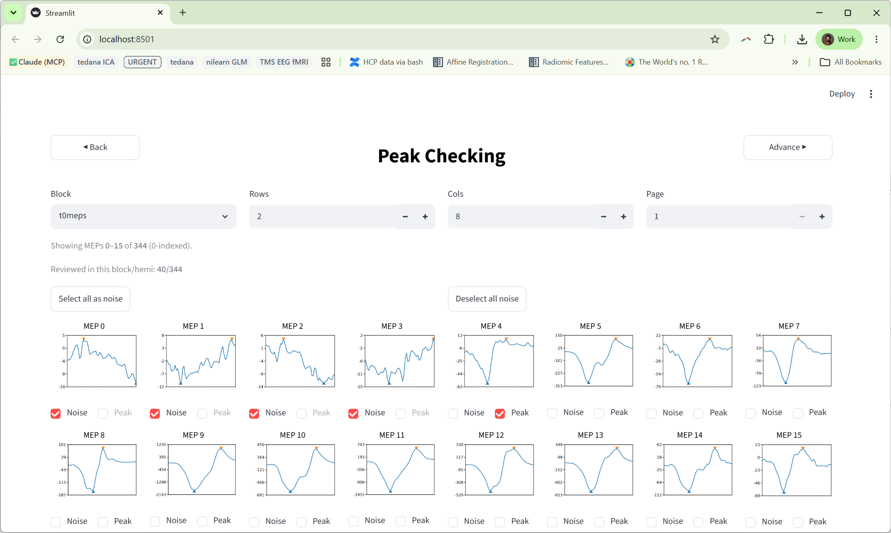
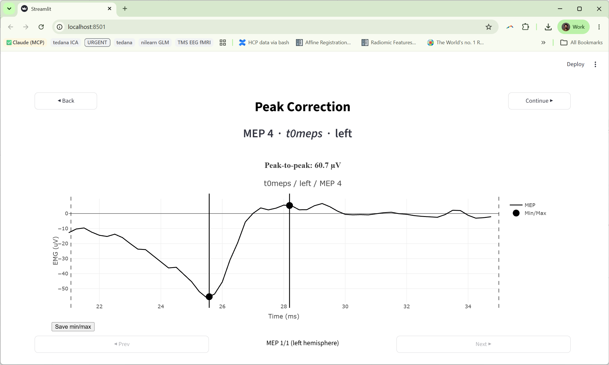
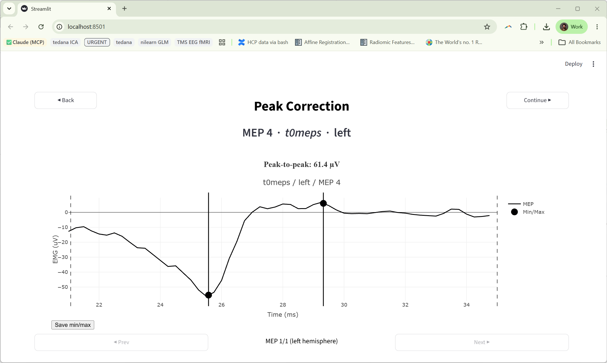
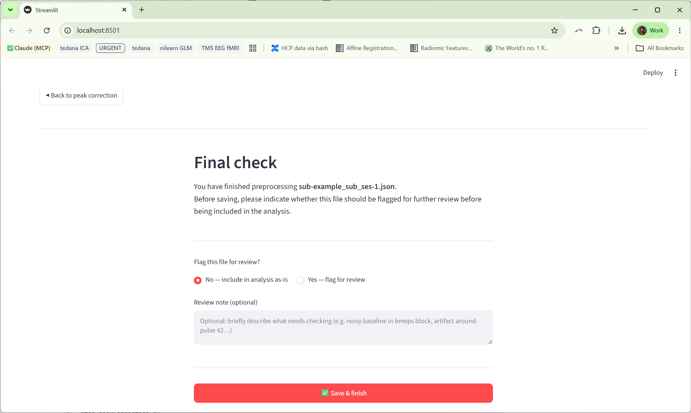

# User Guide

This guide expands on the [Quick Guide](quickguide.md): it explains each menu in
detail, documents the structure of the output files, defines every quality-control
flag, and shows how to edit or create experiment templates.

- [The workflow and its screens](#the-workflow-and-its-screens)
- [Output data structure](#output-data-structure)
- [Quality-control flags](#quality-control-flags)
- [Experiment templates](#experiment-templates)
- [The processed-sessions registry](#the-processed-sessions-registry)
- [Signal filtering on load](#signal-filtering-on-load)

---

## The workflow and its screens

The app is a seven-screen router. State is kept in a single session JSON file that
is created in Step 2 and progressively filled in by later steps. Navigation is via
**Back/Next** buttons; you can revisit earlier steps without losing work.

### Step 1 — Input



Collects paths and metadata and validates them before letting you continue. Fields:

| Field | Meaning |
|-------|---------|
| **Experiment template file** | Template describing channels and block order. A bare filename is resolved inside `config/`; an absolute path is also accepted. |
| **Data directory** | Folder scanned for `.bin` recordings; populates the EMG-file dropdown. |
| **Output folder** | Destination for session JSON files. Created automatically if it doesn't exist. |
| **EMG file** | The recording to process, chosen from the data directory. Already-processed files are indicated via the registry. |
| **Researcher ID** | Free-text identifier stamped into each output for provenance. |
| **Subject ID** / **Session** | Used to name the output file `sub-<id>_ses-<session>.json`. |
| **Sampling Rate (Hz)** | Acquisition rate; default `4000`. Must match the recording. |
| **Hemisphere(s)** | `left`, `right`, or both — determines which EMG channel(s) are analysed and how many MEP columns each block has. |

The paths and researcher ID you enter are saved back to
`config/.tms_emg_gui_settings.json` so the next launch remembers them.

### Step 2 — Confirm inputs



Shows a read-only summary of your choices. **Confirm** loads the template
(resolving channels and the block structure, including the optional resting-EMG
reference) and creates or updates the session file. If the named template can't be
found, you're sent back to Step 1 with an error.

### Step 3 — Segmentation



An embedded **Bokeh server** plot shows the full recording so you can mark where
each experiment block occurs.

- **Active blocks** (multiselect) — choose which blocks from the template are
  present in this particular recording. Changes are written to the session file
  immediately so validation always reflects the current selection.
- **Range selection** — for each active block, drag to select its `[start, end]`
  span in seconds. Blocks ending in `meps` carry the TMS pulses; the special
  `mh` (motor hotspot) and `mvic` spans and, if the template enables it, the
  `emg_ref` (resting-EMG reference) span are marked here too.
- **Update** — applies block activation/deactivation: it restarts the Bokeh app
  and clears stored ranges for any block you switched off.

An **extra controls** menu provides housekeeping actions — deleting a single
timepoint or an entire segment — and a **downsampling** control that trades plot
resolution for speed when drawing long recordings:



When you continue, the app:
1. detects TMS pulses from the synch channel within each MEP block,
2. computes a **resting reference** from the `emg_ref` span (if present), and
3. sets the **pre-activation flags** (`hinder_preactivation_flag`,
   `std_preactivation_flag`) for every pulse — see [flags](#quality-control-flags).

### Step 4 — MEP window



An embedded Bokeh plot overlays all detected MEPs, aligned to the pulse. Drag to
select the measurement window (in seconds, relative to the pulse). On continue the
window is stored as `mep_window = [beg_s, end_s]` and the app computes, for every
MEP in every active block and hemisphere, the **min** and **max** sample inside
that window (the basis of the peak-to-peak amplitude).

### Step 5 — Peak checking



MEPs are rendered with Matplotlib in a paged grid, per block and hemisphere, with
the auto-detected min/max marked. Two independent checkboxes per MEP:

- **Noise** (`noise_flag`) — the trial is unusable; it is excluded and its
  *needs-correction* box is disabled.
- **Needs correction** (`peaks_flag`) — the automatic peak positions are wrong and
  must be fixed in Step 6.

**Select all / Deselect all** set the noise flag for every MEP on the current
page. Only blocks listed in `active_blocks` are shown.

### Step 6 — Peak correction





For each MEP flagged *needs correction* (and not *noise*), an embedded
**Dash/Plotly** editor lets you drag two cursors onto the true min and max. The
**peak-to-peak amplitude updates live inside the editor** on every drag. Corrected
values overwrite the stored min/max for that MEP.

### Step 7 — Review & flag



A final decision screen:

- **Flag for review** (`flag_for_review`) + **review note** (`review_note`) —
  record that the file needs a second look, with optional free text, **or** leave
  unflagged.

**Finish** writes the flag and note, adds/updates the file's entry in the
[processed-sessions registry](#the-processed-sessions-registry), clears
pipeline-specific state, and returns to Step 1 for the next recording.

---

## Output data structure

Each processed recording produces one file in your output folder named
`sub-<SubjectID>_ses-<Session>.json`. Top-level keys:

```jsonc
{
  "info": {
    "template_file":    "experiment_template.json",
    "input_file":       "<path to the .bin>",
    "data_dir":         "<data folder>",
    "sampling_rate":    4000,
    "session":          1,
    "hemispheres":      ["left"],
    "output_dir":       "<output folder>",
    "researcher_id":    "FFV",
    "pipeline_version": "1.1.0"        // stamped from code, never user-edited
  },

  "active_blocks":   ["bmeps", "t0meps", "t10meps", "t20meps", "t30meps"],

  "segmentation": {
    "mh":     [[start_s, end_s]],
    "emg_ref":[[start_s, end_s]],
    "bmeps":  [[start_s, end_s]],
    "...":    []                       // one entry per template block; [] if unset
  },

  "mep_window": [beg_s, end_s],        // seconds, relative to each pulse

  "meps": {
    "bmeps": {
      "left": {
        "pulses":                    [t0, t1, ...],   // pulse sample indices
        "min":                       [v0, v1, ...],   // min within the window (uV)
        "max":                       [v0, v1, ...],   // max within the window (uV)
        "hinder_preactivation_flag": [0, 1, ...],
        "std_preactivation_flag":    [0, 0, ...],
        "peaks_flag":                [0, 0, ...],
        "noise_flag":                [0, 0, ...],
        "below_threshold_flag":      [0, 0, ...]
      }
      // one entry per hemisphere
    }
    // one entry per MEP-bearing block
  },

  "flag_for_review": false,
  "review_note":     ""
}
```

Notes:
- All flag arrays are **parallel to `pulses`**: index *i* in every list refers to
  the same MEP. Peak-to-peak amplitude for MEP *i* is `max[i] − min[i]`.
- `segmentation` holds one key per block in the template (plus `mh`, `mvic`,
  and—when enabled—`emg_ref`). An unset block is an empty list `[]`; a set block
  is a single `[[start_s, end_s]]` range.
- `info.pipeline_version` is written from a code constant and is not read from any
  user-editable file, so it reliably records which pipeline produced the file.

### Reading amplitudes in analysis

For a block/hemisphere, iterate the parallel arrays and skip excluded trials:

```python
import json

s = json.load(open("output/sub-001_ses-1.json"))
hemi = s["meps"]["bmeps"]["left"]

amps = []
for i in range(len(hemi["pulses"])):
    if hemi["noise_flag"][i]:            # unusable trial
        continue
    if hemi["min"][i] is None or hemi["max"][i] is None:
        continue
    amps.append(hemi["max"][i] - hemi["min"][i])   # peak-to-peak (uV)
```

---

## Quality-control flags

Each MEP carries five 0/1 flags. They fall into two groups: **pre-activation**
flags, set automatically during segmentation from the EMG just *before* the pulse,
and **peak** flags, set during checking/correction. All are stored per MEP, in
arrays parallel to `pulses`.

| Flag | Set in | Meaning | How it's computed |
|------|--------|---------|-------------------|
| `hinder_preactivation_flag` | Step 3 (auto) | Too much background EMG before the pulse (absolute criterion). | The standard deviation of the rectified EMG in a 50 ms window ending just before the pulse exceeds a fixed **15 µV** threshold. Adapted from Hinder et al. (2014). |
| `std_preactivation_flag` | Step 3 (auto) | Too much background EMG before the pulse (relative criterion). | The same pre-pulse measure exceeds the **resting reference** (the std of the rectified `emg_ref` baseline span). Adapted from McCambridge et al. (2020). Requires an `emg_ref` span. |
| `peaks_flag` | Step 5 (manual) | The automatic min/max peak positions are wrong; the MEP needs manual correction. | Set when you tick **Needs correction**; cleared after you fix it in Step 6 or if you mark it noise. |
| `noise_flag` | Step 5 (manual) | The trial is unusable (artefact, no clean signal); exclude it. | Set when you tick **Noise**; setting it disables `peaks_flag` for that MEP. |
| `below_threshold_flag` | schema | Reserved marker for MEPs whose amplitude falls below a detection threshold. | Present in every MEP record and initialised to `0`. It is part of the schema for downstream use; the current GUI does not auto-populate it. |

Interpreting them in analysis:
- **Exclude** any MEP with `noise_flag == 1`.
- Treat `hinder_preactivation_flag` / `std_preactivation_flag` as **pre-activation
  warnings** — decide per your protocol whether to exclude or report them.
- After Step 6, a remaining `peaks_flag == 1` means a MEP was flagged but not
  corrected; review those.

> The pre-activation window is a 50 ms span ending ~5 samples before each pulse, on
> the rectified EMG of the analysed hemisphere. The resting reference is taken from
> the first 50 ms of the `emg_ref` span.

---

## Experiment templates

A template is a small JSON file in `config/` that tells the app how a recording is
laid out. The bundled one, `config/experiment_template.json`:

```json
{
  "experiment_name": "PDM_TMS_Study",
  "channels": {
    "synch_pulse": 3,
    "right": 1,
    "left": 2
  },
  "experiment_structure": [
    "mh", "rmt", "mvics", "amt",
    "bmeps", "itbs",
    "t0meps", "t10meps", "t20meps", "t30meps",
    "rmt_pos"
  ],
  "other": {
    "include_rest_emg_ref": "yes"
  }
}
```

### Fields

| Field | Meaning |
|-------|---------|
| `experiment_name` | Label for the protocol; recorded with the session. |
| `channels.synch_pulse` | Channel carrying the TMS trigger/synch pulses (used to detect pulses). |
| `channels.right` / `channels.left` | EMG channels for the right and left hemispheres. |
| `experiment_structure` | **Ordered** list of block names making up the protocol. Any block name ending in `meps` is treated as a MEP-bearing block (pulses detected, amplitudes computed). Other names (e.g. `mh`, `rmt`, `mvics`, `amt`, `itbs`, `rmt_pos`) are non-MEP phases you still segment. |
| `other.include_rest_emg_ref` | `"yes"` adds an `emg_ref` span to segmentation, used as the resting baseline for `std_preactivation_flag`. `"no"` omits it (the std pre-activation flag then can't be computed). |

> **Channel numbers** are whatever your acquisition uses for those signals. Confirm
> them against your recording setup; a wrong synch channel means no pulses are
> detected.

### Creating a new template

1. Copy the bundled template inside `config/`:
   ```bash
   cp config/experiment_template.json config/my_experiment.json
   ```
2. Edit `experiment_name`, the three `channels` numbers, and the
   `experiment_structure` list to match your protocol, in acquisition order.
   Name your MEP blocks so they end in `meps`.
3. Set `include_rest_emg_ref` to `"yes"` if you record a resting baseline you want
   to use for the relative pre-activation flag, otherwise `"no"`.
4. In Step 1, set **Experiment template file** to `my_experiment.json` (a bare
   filename is resolved inside `config/`; an absolute path also works).

Keep templates in `config/` and commit them so collaborators can reuse them.

---

## The processed-sessions registry

`config/processed_sessions.json` tracks which recordings have been completed. Each
finished file adds or updates an entry:

```jsonc
{
  "version": 1,
  "processed": [
    {
      "data_file":        "sub-pdm0057_ses-01_....bin",
      "session_file":     "sub-001_ses-1.json",
      "finished_at":      "2026-06-19T10:21:33Z",
      "researcher_id":    "FFV",
      "pipeline_version": "1.1.0"
    }
  ]
}
```

The Input screen uses this registry to indicate which recordings in your data
folder have already been processed, so you can avoid duplicating work.

---

## Signal filtering on load

Every EMG channel is denoised the moment a recording is read, before any
segmentation or amplitude measurement. The filter chain is: a three-level `db1`
wavelet denoise (BayesShrink soft thresholding) → Savitzky–Golay smoothing →
linear detrend. The synch/trigger channel is left raw so pulse detection is
unaffected, and the result is cached so each file is filtered only once.

Because MEPs are sparse (a fraction of a percent of each recording), the wavelet's
automatic noise estimate reflects the baseline noise floor and the filter
preserves MEP peak amplitudes while removing most of the broadband noise.